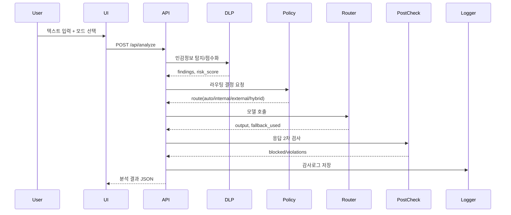
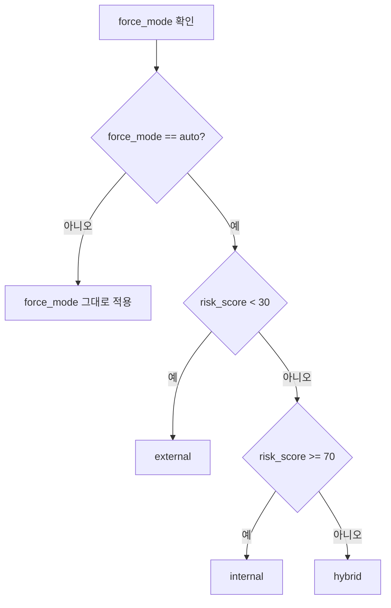
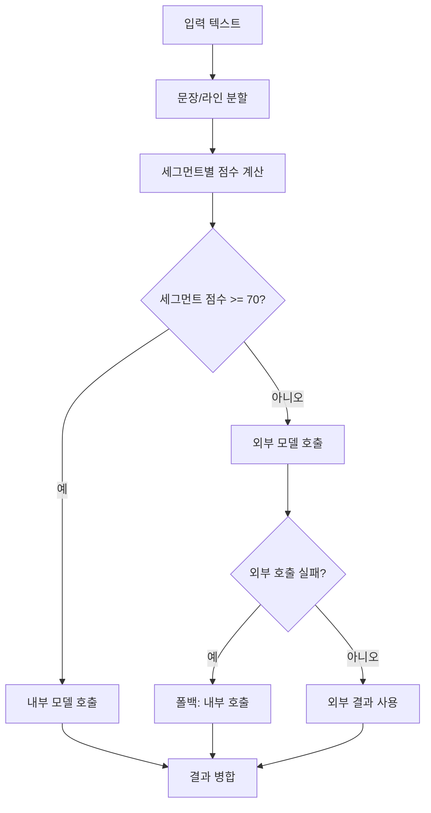

# 구현 흐름도 (PoC MVP)

대상: 보안 LLM Gateway PoC (`PoC/00_mvp`)

---

## 도 1. 전체 시스템 구성도
```mermaid
flowchart LR
  U[사용자(Web UI)] --> API[FastAPI /api/analyze]
  API --> DLP[DLP 탐지 + 위험도 점수화]
  DLP --> POL[정책 엔진]
  POL --> RT[라우팅 엔진]
  RT --> IN[내부 LLM(Mock)]
  RT --> EX[외부 LLM(Mock)]
  IN --> PC[응답 2차 검사(Post-check)]
  EX --> PC
  PC --> RES[결과 반환]
  PC --> LOG[감사로그(JSONL)]
  RES --> U
```

---

## 도 2. 요청 처리 시퀀스


---

## 도 3. 라우팅 의사결정 흐름


---

## 도 4. 토큰화/역치환 흐름
```mermaid
flowchart LR
  I[입력 텍스트] --> M[민감 패턴 탐지]
  M --> T[토큰화(mask_sensitive)]
  T --> R[라우팅 호출]
  R --> O[응답 수신]
  O --> U[역치환(unmask)]
  U --> P[후처리 검사]
```

---

## 도 5. Hybrid(혼합) 라우팅 흐름


---

## 도 6. 응답 2차 검사/차단 흐름
```mermaid
flowchart TD
  A[모델 응답] --> B[Post-check DLP]
  B --> C{위반 탐지?}
  C -- 아니오 --> D[응답 통과]
  C -- 예 --> E[[BLOCKED] 메시지로 대체]
```

---

## 도 7. 감사로그 저장/조회 흐름
```mermaid
flowchart LR
  A[/api/analyze 결과/] --> B[logger.write_audit]
  B --> C[(logs/audit_YYYYMMDD.jsonl)]
  U[UI 로그조회 버튼] --> D[/api/logs]
  D --> C
  C --> D
  D --> U
```

---

## 코드 매핑 표
- 입력/API: `app/main.py` (`/api/analyze`, `/api/logs`, `/api/examples`)
- DLP/점수화: `app/dlp.py`
- 정책 엔진: `app/policy.py`
- 라우팅/폴백: `app/router.py`
- 응답 재검사: `app/postcheck.py`
- 감사로그: `app/logger.py`
- UI: `web/index.html`, `web/app.js`, `web/style.css`
